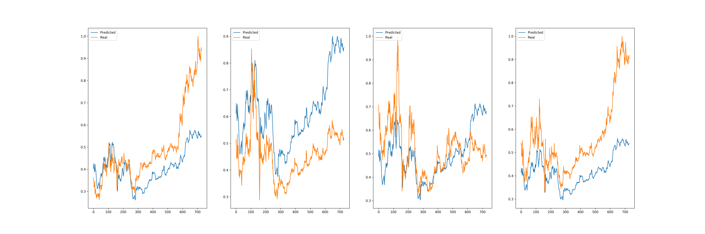

# Personae - RL & SL Methods and Envs For Trading

Personae is a repo of implements and enviorment of Deep Reinforcement Learning & Supervised Learning.  
This repo tries to implement new methods and papers in different ways (TensorFlow or PyTorch) and test them in Financial Market (Stock Market).

# Contents

+ [Deep Deterministic Policy Gradient (DDPG)](algorithm/RL/DDPG.py)   
Implement of DDPG with TensorFlow.
    > arXiv:1509.02971: [Continuous control with deep reinforcement learning](https://arxiv.org/abs/1509.02971)

+ [Policy Gradient](algorithm/RL/PolicyGradient.py)   
Implement of Policy Gradient with TensorFlow.
    > NIPS. Vol. 99. 1999: [Policy gradient methods for reinforcement learning with function approximation](https://papers.nips.cc/paper/1713-policy-gradient-methods-for-reinforcement-learning-with-function-approximation.pdf)

+ [DA-RNN (DualAttnRNN)](algorithm/SL/DualAttnRNN.py)      
Implement of arXiv:1704.02971, DA-RNN with TensorFlow.
    > arXiv:1704.02971: [A Dual-Stage Attention-Based Recurrent Neural Network for Time Series Prediction](https://arxiv.org/abs/1704.02971)

# Experiments

+ [Deep Deterministic Policy Gradient (DDPG)](algorithm/SL/DualAttnRNN.py)
+ [Policy Gradient (PG)](algorithm/RL/PolicyGradient.py)     
Train a Agent to trade in  stock market, using stocks data set from 2008-01-01 to 2018-01-01 where 70% are training data, 30% are testing data.

<p align='center'>
  
   <em>Total Profits and Baseline Profits. (Test Set)</em>
</p>

+ [DA-RNN (DualAttnRNN)](algorithm/SL/DualAttnRNN.py)   
Train a Predictor to predict stock prices, using stocks data set from 2008-01-01 to 2018-01-01, where 70% are training data, 30% are testing data.

<p align='center'>
  
   <em>Prices Prediction Experiments on 4 Bank Stocks. (Test Set)</em>
</p>


# Requirements

Before you start testing, following requirements are needed.

- Python3.5
- TensorFlow-1.4
- PyTorch
- Numpy
- Pandas
- sklearn
- mongoengine
- tushare
- matplotlib
- CUDA (option)
- Docker (option)

It's best that if you are a Docker user, so that you can use run the whole project without installing those dependencies.
 
And you can also use [Ansible](http://www.ansible.com.cn/) to run [CUDA-Playbook](playbook/cuda-playbook.yml) and [Docker-Playbook](playbook/docker-playbook.yml) to install CUDA and [Nvidia-Docker](https://github.com/NVIDIA/nvidia-docker) if you want to run tests in a Docker Container.

# How to Use

### If you use Docker

#### About base image
My image for this repo is [ceruleanwang/haru](https://hub.docker.com/r/ceruleanwang/haru/), and haru is inherited from [ceruleanwang/quant](https://hub.docker.com/r/ceruleanwang/quant-base/).   
The image ceruleanwang/quant is inherited from [nvidia/cuda:8.0-cudnn6-runtime](https://hub.docker.com/r/nvidia/cuda/).   
So please make sure your CUDA version and cuDNN version are correct. 

#### Instructions
First you should make sure you have stocks data in your mongodb.
If you don't have, you can use a spider writen in this repo to crawl stocks data by following code:   
```
docker run -t -v local_project_dir:docker_project_dir --network=your_network ceruleanwang/haru spider/finance.py
```
But remember to set stock codes that you want to crawl, the default are:
```
codes = ["600036", "601328", "601998", "601398"]
```
And they can be modified in:   
+ [Default Args Parser](helper/args_parser.py)

You can also use a mongo container (option) by following code:
```
docker run -p 27017:27017 -v /data/db:/data/db -d --network=your_network mongo
``` 
Then you can just run a model by:

```
docker run -t -v local_project_dir:docker_project_dir --network=yuor_network ceruleanwang/haru algorithm/RL or SL/algorithm_name.py
```

### If you use Conda
You can create an env yourself, and install Python3.5 and all dependencies required, then just run algorithm in your way. 


# TODO
- More Implementations of Papers.
- More High-Frequency Stocks Data.
