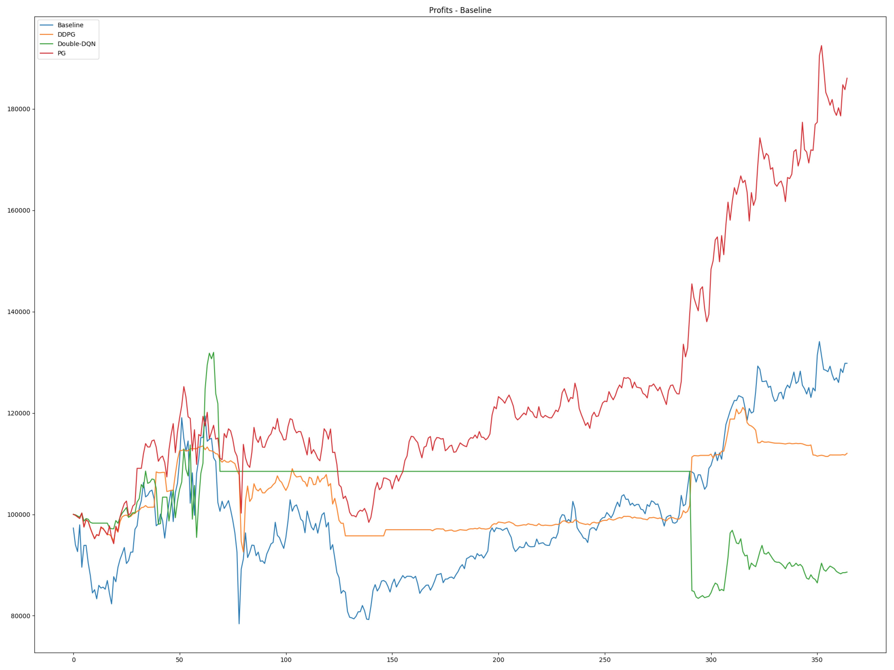
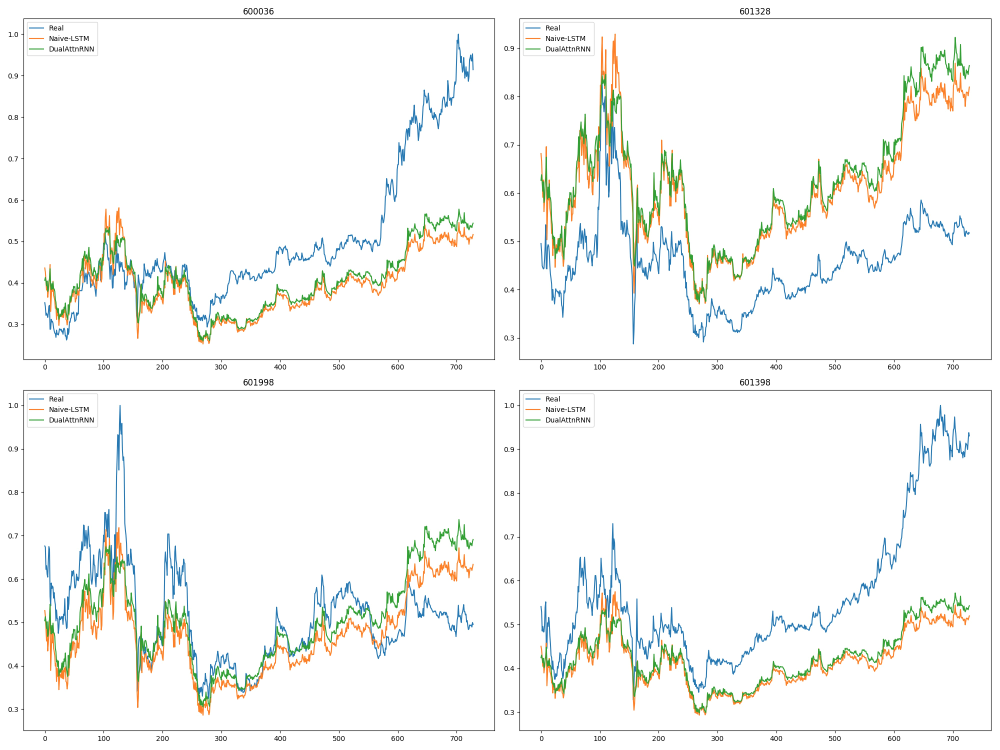

[](/LICENSE)
[](https://www.tensorflow.org/)
[]()
[](https://hub.docker.com/r/ceruleanwang/personae/)

# Personae - RL & SL Methods and Envs For Quantitative Trading

Personae is a repo that implements papers proposed methods in Deep Reinforcement Learning & Supervised Learning and applies them to Financial Market.

Now Personae includes 4 RL & 3 SL implements and a simulate Financial Market supporting Stock and Future. (Short Sale is still implementing)

More RL & SL methods are updating!

# WARNING

This repo is being reconstructing,

It will start from 2018-08-24 to ~2018-09-01~ a timestamp that I successfully found a job.


# Attentions  

- The features as inputs are naive.   
- Day frequency is clearly not enough.  
- It's recommended that you could replace the features here to your own.   

# Contents

+ [Deep Deterministic Policy Gradient (DDPG)](algorithm/RL/DDPG.py)   
Implement of DDPG with TensorFlow.
    > arXiv:1509.02971: [Continuous control with deep reinforcement learning](https://arxiv.org/abs/1509.02971)

+ [Double DQN](algorithm/RL/DoubleDQN.py)    
Implement of Double-DQN with TensorFlow.   
    > arXiv:1509.06461: [Deep Reinforcement Learning with Double Q-learning](https://arxiv.org/abs/1509.06461)
    
+ [Dueling-DQN](algorithm/RL/DuelingDQN.py)     
Implement of Dueling-DQN with TensorFlow.    
    > arXiv:1511.06581: [Dueling Network Architectures for Deep Reinforcement Learning](https://arxiv.org/abs/1511.06581)     

+ [Policy Gradient](algorithm/RL/PolicyGradient.py)   
Implement of Policy Gradient with TensorFlow.
    > NIPS. Vol. 99. 1999: [Policy gradient methods for reinforcement learning with function approximation](https://papers.nips.cc/paper/1713-policy-gradient-methods-for-reinforcement-learning-with-function-approximation.pdf)

+ [DA-RNN (DualAttnRNN)](algorithm/SL/DualAttnRNN.py)      
Implement of arXiv:1704.02971, DA-RNN with TensorFlow.
    > arXiv:1704.02971: [A Dual-Stage Attention-Based Recurrent Neural Network for Time Series Prediction](https://arxiv.org/abs/1704.02971)

+ [TreNet (HNN)](algorithm/SL/TreNet.py)     
Implement of TreNet with TensorFlow.    
    > IJCAI 2017. [Hybrid Neural Networks for Learning the Trend in Time Series](https://www.ijcai.org/proceedings/2017/0316.pdf)

+ [Naive-LSTM (LSTM)](algorithm/SL/NaiveLSTM.py)    
Implement of simple LSTM based model with TensorFlow.    
    > arXiv:1506.02078: [Visualizing and Understanding Recurrent Networks](https://arxiv.org/abs/1506.02078)     

# Environment

A basic simulate environment of Financial Market is implemented.

- [Market](base/env/market.py)   
Implement of Market, Trader, Positions as a gym env (gym is not required), which can give a env for regression or sequence data generating for RL or SL model.  
For now, Market support Stock Data and Future Data.

Also, more functions are updating.

# Experiments

+ [Deep Deterministic Policy Gradient (DDPG)](algorithm/SL/DualAttnRNN.py)
+ [Double-DQN](algorithm/RL/DoubleDQN.py)    
+ [Dueling-DQN](algorithm/RL/DuelingDQN.py)
+ [Policy Gradient (PG)](algorithm/RL/PolicyGradient.py)     
Train a Agent to trade in stock market, using stock data set from 2012-01-01 to 2018-01-01 where 70% are training data, 30% are testing data.

<p align='center'>
  
   <em>Total Profits and Baseline Profits. (Test Set)</em>
</p>

+ [DA-RNN (DualAttnRNN)](algorithm/SL/DualAttnRNN.py)   
+ [Naive-LSTM (LSTM)](algorithm/SL/NaiveLSTM.py)      
+ [TreNet (HNN)](algorithm/SL/TreNet.py)     
Train a Predictor to predict stock prices, using stock data set from 2008-01-01 to 2018-01-01, where 70% are training data, 30% are testing data.

<p align='center'>
  
   <em>Prices Prediction Experiments on 4 Bank Stocks. (Test Set)</em>
</p>


# Requirements

Before you start testing, following requirements are needed.

- Python3.5
- TensorFlow1.4
- numpy
- scipy
- pandas
- rqalpha
- sklearn
- tushare
- matplotlib
- mongoengine
- CUDA (option)
- ta-lib (option)
- Docker (option)
- PyTorch (option)

It's best that if you are a Docker user, so that you can run the whole project without installing those dependencies manually.
 
And you can also use [Ansible](http://www.ansible.com.cn/) to run [CUDA-Playbook](playbook/cuda-playbook.yml) and [Docker-Playbook](playbook/docker-playbook.yml) to install CUDA and [Nvidia-Docker](https://github.com/NVIDIA/nvidia-docker) if you want to run tests in a Docker Container.

# How to Use

### If you use Docker

#### About base image
My image for this repo is [ceruleanwang/personae](https://hub.docker.com/r/ceruleanwang/personae/), and personae is inherited from [ceruleanwang/quant-base](https://hub.docker.com/r/ceruleanwang/quant-base/).    
   
The image [ceruleanwang/quant-base](https://hub.docker.com/r/ceruleanwang/quant-base/) is inherited from [nvidia/cuda:8.0-cudnn6-runtime](https://hub.docker.com/r/nvidia/cuda/). So please make sure your CUDA version and cuDNN version are correct. 

#### Instructions
First you should make sure you have stocks data in your mongodb.   

If you don't have, you can use a spider written in this repo to crawl stock or future data, but before you start, you should make sure a mongodb service is running.  

If you don't have mongodb service running, you can also use a mongodb container (option) by following code:
```
docker run -p 27017:27017 -v /data/db:/data/db -d --network=your_network mongo
``` 
Then, you can use spiders to crawl stock data by following code:   
```
docker run -t -v local_project_dir:docker_project_dir --network=your_network ceruleanwang/personae spider/stock_spider.py
```
Also, you can crawl future data by following code:
```
docker run -t -v local_project_dir:docker_project_dir --network=your_network ceruleanwang/personae spider/future_spider.py
```
But remember to set stock or future codes that you want to crawl, the default stock codes are:
```
stock_codes = ["600036", "601328", "601998", "601398"]
```
And the default future codes are:
```
future_codes = ["AU88", "RB88", "CU88", "AL88"]
```
And they can be modified in:   
+ [Default Args Parser](helper/args_parser.py)

Then you can just run a model by:
```
docker run -t -v local_project_dir:docker_project_dir --network=yuor_network ceruleanwang/personae algorithm/RL or SL/algorithm_name.py
```

### If you use Conda
You can create an env yourself, and install Python3.5 and all dependencies required, then just run algorithm in your way.   

One thing should be noticed is that the hostname in [mongoengine](/base/model/__init__.py) config should be your own.

### About training & testing 
For now, all models implemented with TensorFlow support persistence. You can edit many parameters when you are training or testing a model.   
For example, following codes show some parameters that could be edited.
```
env = Market(codes, start_date="2008-01-01", end_date="2018-01-01", **{
    "market": market,
    "mix_index_state": True,
    "training_data_ratio": training_data_ratio,
})

algorithm = Algorithm(tf.Session(config=config), env, env.trader.action_space, env.data_dim, **{
    "mode": mode,
    "episodes": episode,
    "enable_saver": True,
    "enable_summary_writer": True,
    "save_path": os.path.join(CHECKPOINTS_DIR, "RL", model_name, market, "model"),
    "summary_path": os.path.join(CHECKPOINTS_DIR, "RL", model_name, market, "summary"),
})
```
# TODO
- More Implementations of Papers.
- More High-Frequency Stocks Data.
